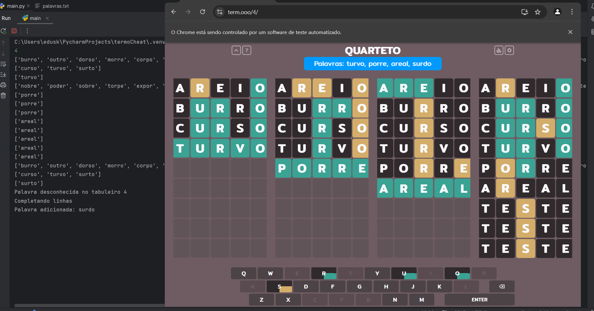

# Resolvedor Automático do Termo

Um projeto que **resolve automaticamente o jogo Termo** usando técnicas de web scraping, filtragem inteligente de palavras e lógica de tentativa. Ideal para estudar **estratégias de automação, algoritmos de eliminação e manipulação de dados com Python**.

## 🔍 Preview

  

## 🧩 Como funciona?

1. O bot começa com uma palavra inicial
2. Verifica o retorno (letras corretas, letras fora de posição, letras inválidas).
3. Filtra as palavras do dicionário interno com base nas pistas recebidas.
4. Faz uma nova tentativa, repetindo o processo até encontrar a palavra certa.
5. As palavras possíveis são exibidas no terminal a cada filtragem.
6. Caso se depare com uma palavra que não conheça em um tabuleiro, ele resolve o próximo.
7. Chega até o final do jogo e registra a palavra no dicionário com base na mensagem de derrota.

## 🕹️ Como usar
- Pressione enter para termo
- Digite 2 para dueto
- Digite 4 para quarteto

## ▶️ Como Executar
1. Instale os requisitos:
<pre><code> pip install -r requirements.txt </code></pre>
2. Execute o script:
<pre><code> python termoResolvedor.py </code></pre>
